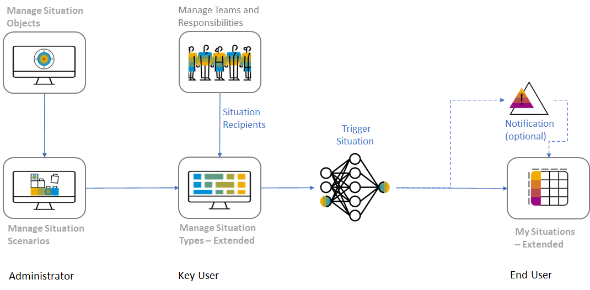

# DT263 - Focus on Issues in Your Business : Custom Situation Handling Use Cases

## Description

This repository contains the material for the SAP TechEd 2022 session called DT263 - Focus on Issues in Your Business :Custom Situation Handling Use Cases.

## Overview

This session introduces attendees to implement a custom Situation Handling use case in SAP S/4HANA Cloud to notify owner of costcenter that budget is already consumed by 70 Percent

## Requirements

The requirements to follow the exercises in this repository are...

## Exercises

Provide the exercise content here directly in README.md using [markdown](https://guides.github.com/features/mastering-markdown/) and linking to the specific exercise pages, below is an example.

- [Getting Started](exercises/ex0/)
- [Exercise 1 - Create Situation Object](exercises/ex1/)
    - [Exercise 1.1 - Provide General Information for Situation Object](exercises/ex1#exercise-11-sub-exercise-1-description)
    - [Exercise 1.2 - Provide Structure Information](exercises/ex1#exercise-12-sub-exercise-2-description)
    - [Exercise 1.3 - Provide Navigation Target Information](exercises/ex1#exercise-13-sub-exercise-3-description)
    - [Exercise 1.4 - Provide End-User Action Information](exercises/ex1#exercise-14-sub-exercise-4-description)
- [Exercise 2 - Create Situation Scenario](exercises/ex2/)
    - [Exercise 2.1 - Provide General Information for Situation Scenario](exercises/ex2#exercise-21-sub-exercise-1-description)
    - [Exercise 2.2 - Provide Anchor Object Information](exercises/ex2#exercise-22-sub-exercise-2-description)
    - [Exercise 2.3 - Add Instance Key](exercises/ex2#exercise-23-sub-exercise-2-description)
    - [Exercise 2.4 - Add Situation Triggers and Enter General Information for Situation Trigger](exercises/ex2#exercise-24-sub-exercise-2-description)
    - [Exercise 2.5 - Provide Trigger Object Information](exercises/ex2#exercise-25-sub-exercise-2-description)
    - [Exercise 2.6 - Add Situation Page Layout](exercises/ex2#exercise-26-sub-exercise-2-description)
    - [Exercise 2.7 - Add Actions](exercises/ex2#exercise-27-sub-exercise-2-description)
    - [Exercise 2.8 - Save Scenario](exercises/ex2#exercise-28-sub-exercise-2-description)
 - [Exercise 3 - Create Situation Template](exercises/ex3/)
    - [Exercise 3.1 - Provide General Information for Situation Template](exercises/ex3#exercise-31-sub-exercise-1-description)
    - [Exercise 3.2 - Add Situaton Trigger(Batch Based)](exercises/ex3#exercise-32-sub-exercise-1-description)
    - [Exercise 3.3 - Add Recipients](exercises/ex3#exercise-33-sub-exercise-1-description)
 - [Exercise 4 - Create Situation Type](exercises/ex4/)
    - [Exercise 4.1 - Provide General Information for Situation Template and create type](exercises/ex4#exercise-41-sub-exercise-1-description)
    - [Exercise 4.2 - Enter Batch Job Scheduling details](exercises/ex4#exercise-42-sub-exercise-2-description)
    - [Exercise 4.3 - Trigger Batch to Generate Instances](exercises/ex4#exercise-43-sub-exercise-3-description)
  
**OR** Link to the Tutorial Navigator for example...

Start the exercises [here](https://developers.sap.com/tutorials/abap-environment-trial-onboarding.html).

**IMPORTANT**

Your repo must contain the .reuse and LICENSES folder and the License section below. DO NOT REMOVE the section or folders/files. Also, remove all unused template assets(images, folders, etc) from the exercises folder. 

## Contributing
Please read the [CONTRIBUTING.md](./CONTRIBUTING.md) to understand the contribution guidelines.

## Code of Conduct
Please read the [SAP Open Source Code of Conduct](https://github.com/SAP-samples/.github/blob/main/CODE_OF_CONDUCT.md).

## How to obtain support

Support for the content in this repository is available during the actual time of the online session for which this content has been designed. Otherwise, you may request support via the [Issues](../../issues) tab.

## License
Copyright (c) 2023 SAP SE or an SAP affiliate company. All rights reserved. This project is licensed under the Apache Software License, version 2.0 except as noted otherwise in the [LICENSE](LICENSES/Apache-2.0.txt) file.
