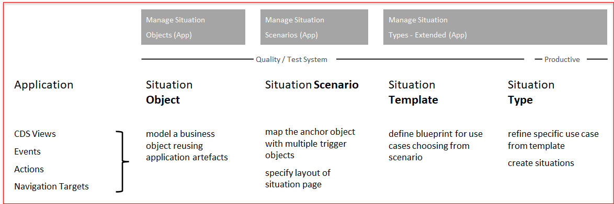

# Understand the scenario

In these exercises you will create situation object(Manage Situation Object), create situation scenario(Manage Situation Scenario), create situation template(Manage Situation Types - Extended) and assign person responsible(Resposibility Management), create type from template and trigger situation(Manage Situation Types - Extended). You will also see notification about the situation that has occured and you will also be able to see the situation instance in My Situation - Extended app.

## Result
You will see notification about the situation that has occured and you will also be able to see the situation instance in My Situation - Extended app. These exercises will provide overview of situation handling extended framework.

Now that you have an ovreview about situation handling framework
Continue to - [Exercise 1 - Create Situation Object](../ex1/README.md)
